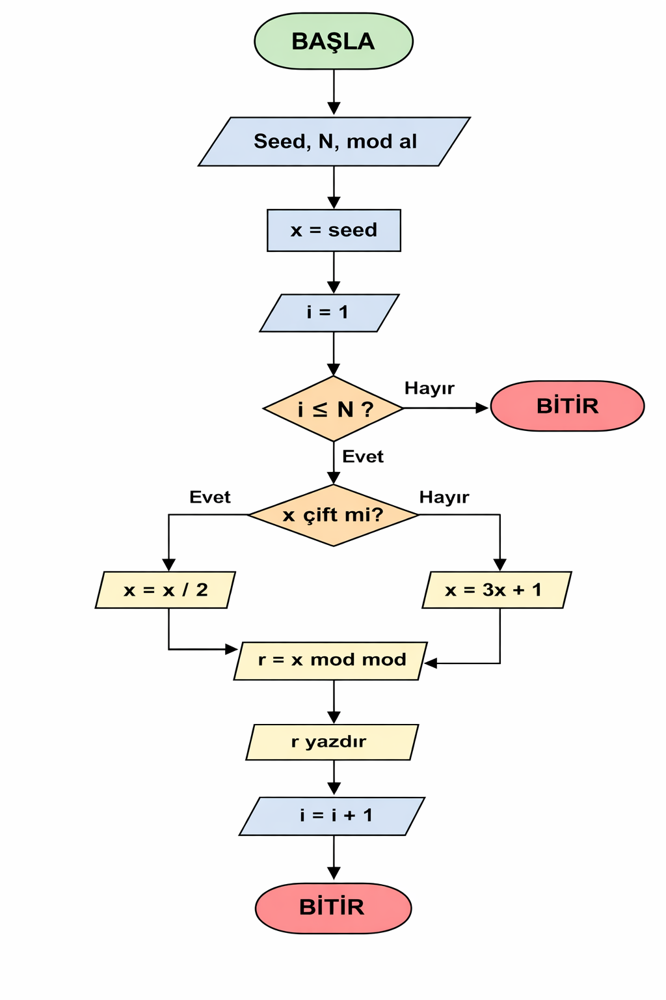
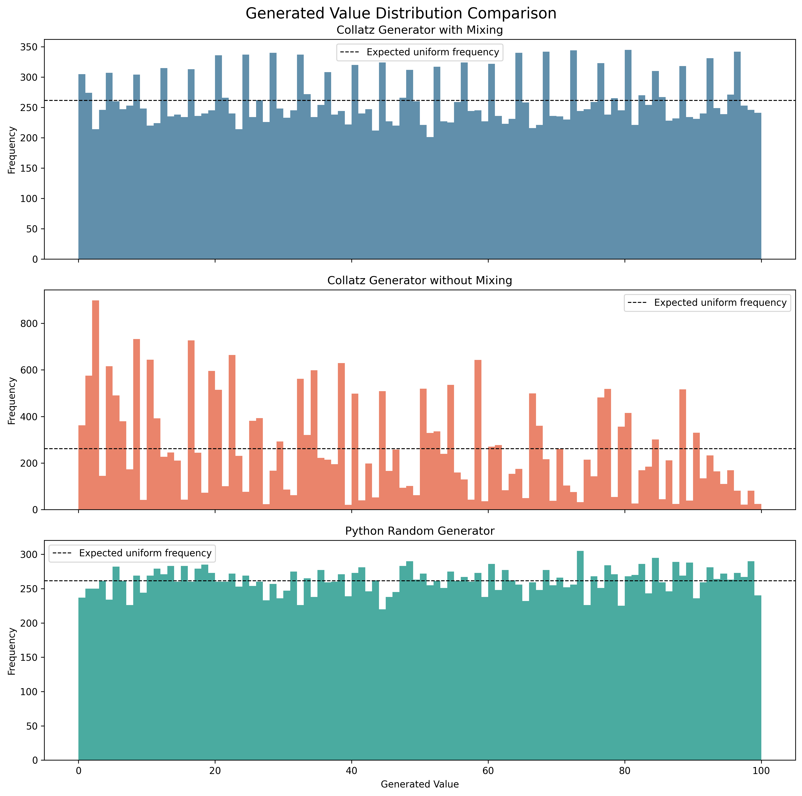

# Collatz Random Number Generator


A deterministic pseudo-random number generator based on the Collatz sequence.

This educational project explores whether values derived from Collatz sequences can be transformed into pseudo-random-looking numbers. It includes a command-line interface, CSV export, automated tests, statistical analysis, data visualization, and continuous integration.

> [!WARNING]
> This generator is deterministic and is not cryptographically secure. It must not be used for passwords, encryption keys, authentication tokens, or other security-sensitive applications.

## Features

* Generates deterministic values from a positive integer seed
* Applies optional 32-bit bit-mixing
* Supports configurable output ranges and sampling steps
* Limits the number of generated values
* Exports generated values to CSV
* Validates command-line parameters
* Compares mixed and unmixed Collatz output with Python's random generator
* Calculates statistical quality metrics
* Produces a distribution comparison chart
* Includes 11 automated unit tests
* Runs tests automatically with GitHub Actions
* Supports Python 3.10, 3.12, and 3.13

## How It Works

The standard Collatz rule is defined as follows:

* If `n` is even, the next value is `n / 2`.
* If `n` is odd, the next value is `3n + 1`.
* The process continues until the sequence reaches `1`.

The generator samples values from this sequence and maps them into the requested output range. By default, an additional deterministic bit-mixing operation is applied to reduce visible patterns in the raw sequence.

## Flowchart

<p align="center">
  
</p>

## Project Structure

```text
collatz-random-number-generator/
├── .github/
│   └── workflows/
│       └── tests.yml
├── images/
│   └── distribution_comparison.png
├── results/
│   └── randomness_metrics.csv
├── tests/
│   └── test_collatz_rng.py
├── .gitignore
├── analyze_randomness.py
├── collatz-flowchart.png
├── collatz_rng.py
├── README.md
└── requirements.txt
```

## Installation

Clone the repository:

```bash
git clone https://github.com/betulaltunyuva/collatz-random-number-generator.git
cd collatz-random-number-generator
```

Install the required dependency:

```bash
python -m pip install -r requirements.txt
```

## Basic Usage

Run the generator with its default settings:

```bash
python collatz_rng.py
```

Default configuration:

* Seed: `27`
* Output range: `0–99`
* Sampling step: `3`
* Mixing: enabled
* Generated values: all available sampled values

## Command-Line Options

```text
--seed SEED       Positive integer used as the initial value
--mod MOD         Upper bound of the output range
--step STEP       Sampling interval within the Collatz sequence
--limit LIMIT     Maximum number of Collatz operations
--count COUNT     Maximum number of output values
--no-mix          Disables the bit-mixing operation
--output PATH     Exports generated values to a CSV file
```

Display the built-in help message:

```bash
python collatz_rng.py --help
```

## Usage Examples

Generate 10 values between 0 and 49:

```bash
python collatz_rng.py --seed 31 --mod 50 --step 2 --count 10
```

Generate values without bit-mixing:

```bash
python collatz_rng.py --seed 27 --count 20 --no-mix
```

Generate values and export them to CSV:

```bash
python collatz_rng.py --seed 31 --mod 50 --step 2 --count 10 --output results/numbers.csv
```

## Statistical Analysis

Run the comparison script:

```bash
python analyze_randomness.py
```

The analysis compares:

1. Collatz generator with mixing
2. Collatz generator without mixing
3. Python's seeded random generator

It calculates the following metrics:

* Value count
* Mean
* Standard deviation
* Number of unique values
* Output-range coverage
* Normalized entropy
* Chi-square statistic
* Serial correlation

The analysis uses seeds from `2` through `500`, an output range of `0–99`, and a sampling step of `1`.

## Analysis Results

| Generator              |    Mean | Std. Dev. | Coverage | Normalized Entropy | Chi-Square | Serial Correlation |
| ---------------------- | ------: | --------: | -------: | -----------------: | ---------: | -----------------: |
| Collatz with mixing    | 49.6176 |   28.9583 |   1.0000 |             0.9976 |   599.4741 |            -0.0037 |
| Collatz without mixing | 41.0547 |   28.4713 |   1.0000 |             0.9329 | 16275.0201 |             0.4195 |
| Python random          | 49.7562 |   28.9184 |   1.0000 |             0.9995 |   118.2898 |             0.0106 |

All three generators covered the complete output range. Bit-mixing substantially improved the Collatz generator's normalized entropy and reduced its serial correlation compared with the unmixed version.

However, Python's random generator achieved a lower chi-square statistic and a distribution closer to uniformity. Therefore, the Collatz-based generator should be treated as an educational deterministic experiment rather than a replacement for established pseudo-random number generators.

## Distribution Comparison

<p align="center">
  
</p>

The complete metric output is available in:

```text
results/randomness_metrics.csv
```

## Running the Tests

Run all 11 unit tests:

```bash
python -m unittest discover -s tests -v
```

The tests cover:

* Even and odd Collatz operations
* A known Collatz sequence
* Deterministic output
* Different seed behavior
* Output-range validation
* Output count limits
* Optional mixing
* Bit rotation
* Invalid parameters
* CSV export

## Continuous Integration

GitHub Actions automatically runs the following checks after every push and pull request to the `main` branch:

* Unit tests
* Command-line smoke test
* Statistical-analysis smoke test

The workflow tests the project with Python 3.10, 3.12, and 3.13.

## Limitations

* The output is completely deterministic.
* Statistical results depend on the selected seeds and parameters.
* Passing basic statistical measurements does not prove true randomness.
* The generator is not suitable for cryptographic or security-related use.
* Collatz sequence termination has not been mathematically proven for every positive integer.

## Technologies

* Python
* Python Standard Library
* Matplotlib
* unittest
* GitHub Actions

## License

This project is licensed under the MIT License. See the `LICENSE` file for details.

## Author

**Betül Altunyuva**

* GitHub: [@betulaltunyuva](https://github.com/betulaltunyuva)
